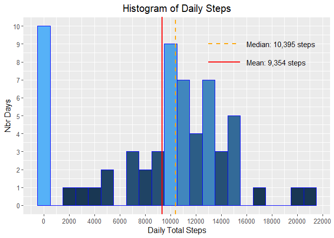
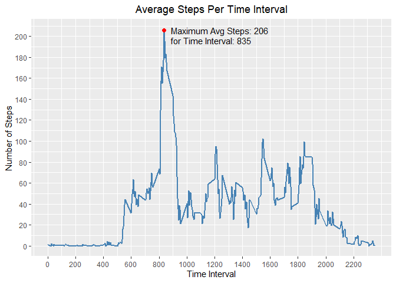
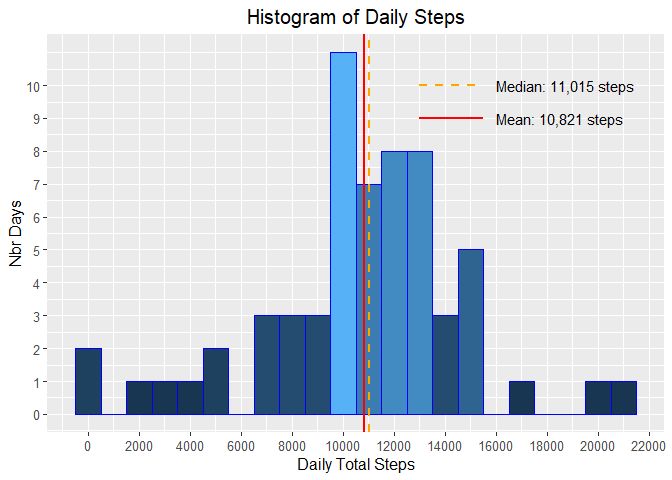
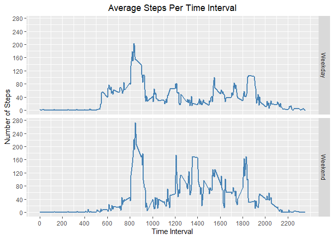

#### Malyaban Das  
#### May 2 2020

## Loading and preprocessing the data

```r
suppressPackageStartupMessages(library(lubridate))

# unzip file if not already in directory
if (file.exists("activity.csv") == FALSE) {
    unzip("activity.zip","activity.csv")
}

# load dataframe and convert "date" column (char) to a date field
activity <- read.csv("activity.csv", stringsAsFactors = FALSE)
activity$date <- ymd(activity$date)
```

## What is mean total number of steps taken per day?

```r
suppressPackageStartupMessages(library(dplyr))
suppressPackageStartupMessages(library(ggplot2))

# group data by day and apply a sum to get total steps per day
activity_by_day <- activity %>% 
    group_by(date) %>% 
    summarise(daily_total = sum(steps, na.rm = TRUE))

# calculate mean of the total steps per day
mean_steps <- round(mean(activity_by_day$daily_total, na.rm = TRUE))
median_steps <- median(activity_by_day$daily_total)

# create histogram
g <- ggplot(activity_by_day,aes(daily_total))
g + geom_histogram(binwidth = 1000
                   , col = "blue"
                   , aes(fill = ..count..)) +
    scale_x_continuous(breaks = c(seq(0,22000,2000))) +
    scale_y_continuous(breaks = c(seq(0,10,1))) +
    geom_vline(xintercept = median_steps
               , col = "orange"
               , linetype = "dashed"
               , lwd = 1) +
    annotate(geom = "text", x = 16000, y =9
             , label = paste("Median:",format(median_steps, big.mark=",", scientific=FALSE), "steps")
             , size = 4
             , hjust = 0) +
    annotate(geom = "segment", x = 13000, xend = 15500
             , y = 9, yend = 9
             , col = "orange"
             , linetype = "dashed"
             , lwd = 1) +
    geom_vline(xintercept = mean_steps
               , col = "red"
               , lwd = 1) +
    annotate(geom = "text", x = 16000, y = 8
             , label = paste("Mean:",format(mean_steps, big.mark=",", scientific=FALSE), "steps")
             , size = 4
             , hjust = 0) +
    annotate(geom = "segment", x = 13000, xend = 15500
             , y = 8, yend = 8
             , col = "red"
             , lwd = 1) +
    labs(title = "Histogram of Daily Steps"
         , x = "Daily Total Steps"
         , y = "Nbr Days") +
    theme(legend.position = ""
          , title = element_text(size = 12)
          , plot.title = element_text(hjust = 0.5, size = 15)
          , axis.text = element_text(size = 10))
```

<!-- -->

#### Summary (ignoring days where no data was ̥retrieved):  
- Median: 10395 steps per day  
- Mean: 9354 steps per day

## What is the average daily activity pattern?

```r
# group data by interval and apply mean to get average steps per interval
daily_activity <- activity %>% 
    filter(!is.na(steps)) %>%
    group_by(interval) %>% 
    summarise(interval_avg = mean(steps))

# determine the interval with the max average steps
max_interval <- as.numeric(daily_activity[which.max(daily_activity$interval_avg),1])
max_avg_steps <- round(max(daily_activity$interval_avg,na.rm = TRUE))

# create a line graph using ggplot2
g <- ggplot(daily_activity,aes(interval,interval_avg))
g + geom_line(colour = "steelblue", lwd = 1) +
    scale_x_continuous(breaks = c(seq(0,2360,200))) +
    scale_y_continuous(breaks = c(seq(0,220,20))) +
    labs(title = "Average Steps Per Time Interval") +
    xlab("Time Interval") + 
    ylab("Number of Steps") +
    annotate("point"
             , x = max_interval
             , y = max_avg_steps
             , col = "red"
             , size = 2) +
    annotate("text"
             , x = max_interval + 50
             , y = max_avg_steps
             , label = paste("Maximum Avg Steps:", max_avg_steps)
             , hjust = 0) +
    annotate("text"
             , x = max_interval + 50
             , y = max_avg_steps - 10
             , label = paste("for Time Interval:", max_interval)
             , hjust = 0) +
    theme(plot.title = element_text(hjust = 0.5))
```

<!-- -->

#### Time interval 835 has the maximum average number of steps at 206.

## Imputing missing values
There are 2304 “NA” values in the steps column.  
The following method will be used to impute values:
- determine the day of the week  
- determine the time interval  
- if value is missing, then use the average for the same day of week / time interval combination.  

```r
# calculate averages per weekday and interval
activity$wday <- wday(activity$date)
day_time <- activity %>% 
    group_by(wday, interval) %>% 
    summarise(avg_by_daytime = round(mean(steps, na.rm = TRUE)))

# merge averages into new dataframe
activity_clean <- merge(activity,day_time,by = c("wday","interval"))

# replace missing values with the averages
activity_clean$steps[is.na(activity_clean$steps)] <- 
    activity_clean$avg_by_daytime[is.na(activity_clean$steps)]
```
#### Following the cleanse the number of “NA” values is 0.  

#### A histogram of the total steps per day is shown below:

```r
# recalculate the totals per day using the imputed data
by_day_complete <- activity_clean %>% 
    group_by(date) %>% 
    summarise(daily_total = sum(steps, na.rm = TRUE))

mean_complete <- round(mean(by_day_complete$daily_total))
median_complete <- median(by_day_complete$daily_total)

# create histogram and annotate mean and median

g <- ggplot(by_day_complete,aes(daily_total, fill = ..count..))
g + geom_histogram(binwidth = 1000
                   , col = "blue"
                   , aes(fill = ..count..)) +
    scale_x_continuous(breaks = c(seq(0,22000,2000))) +
    scale_y_continuous(breaks = c(seq(0,10,1))) +
    geom_vline(xintercept = median_complete
               , col = "orange"
               , linetype = "dashed"
               , lwd = 1) +
    annotate(geom = "text", x = 16000, y =10
             , label = paste("Median:",format(median_complete, big.mark=",", scientific=FALSE), "steps")
             , size = 4
             , hjust = 0) +
    annotate(geom = "segment", x = 13000, xend = 15500
             , y = 10, yend = 10
             , col = "orange"
             , linetype = "dashed"
             , lwd = 1) +
    geom_vline(xintercept = mean_complete
               , col = "red"
               , lwd = 1) +
    annotate(geom = "text", x = 16000, y = 9
             , label = paste("Mean:",format(mean_complete, big.mark=",", scientific=FALSE), "steps")
             , size = 4
             , hjust = 0) +
    annotate(geom = "segment", x = 13000, xend = 15500
             , y = 9, yend = 9
             , col = "red"
             , lwd = 1) +
    labs(title = "Histogram of Daily Steps"
         , x = "Daily Total Steps"
         , y = "Nbr Days") +
    theme(legend.position = ""
          , title = element_text(size = 12)
          , plot.title = element_text(hjust = 0.5, size = 15)
          , axis.text = element_text(size = 10)) 
```

<!-- -->

#### Comparison between mean and median for non-imputed / imputed datasets:  
 Mean:  
 Non-imputed mean = 9354  
 Imputed mean = 10,821  
 Difference = 1467 steps.  

 Median:  
 Non-imputed median = 10395  
 Imputed median = 11,015  
 Difference = 620 steps. 

## Are there differences in activity patterns between weekdays and weekends?

```r
# create new column denoting weekday or weekend
activity_clean$day_type <- "Weekday"
activity_clean$day_type[activity_clean$wday %in% c(6,7)] <- "Weekend"

# get averages per interval per day type
day_type_activity <- activity_clean %>%
    group_by(day_type, interval) %>% 
    summarise(day_type_avg = mean(steps))

# create panel plot comparing weekend averages to weekday averages
g <- g <- ggplot(day_type_activity, aes(interval, day_type_avg))
g + geom_line(colour = "steelblue", lwd = 1) +
    scale_x_continuous(breaks = c(seq(0,2360,200))) +
    scale_y_continuous(breaks = c(seq(0,300,40))) +
    facet_grid(day_type ~ .) +
    ggtitle("Average Steps Per Time Interval") +
    xlab("Time Interval") + 
    ylab("Number of Steps") +
    theme(plot.title = element_text(hjust = 0.5))
```

<!-- -->

